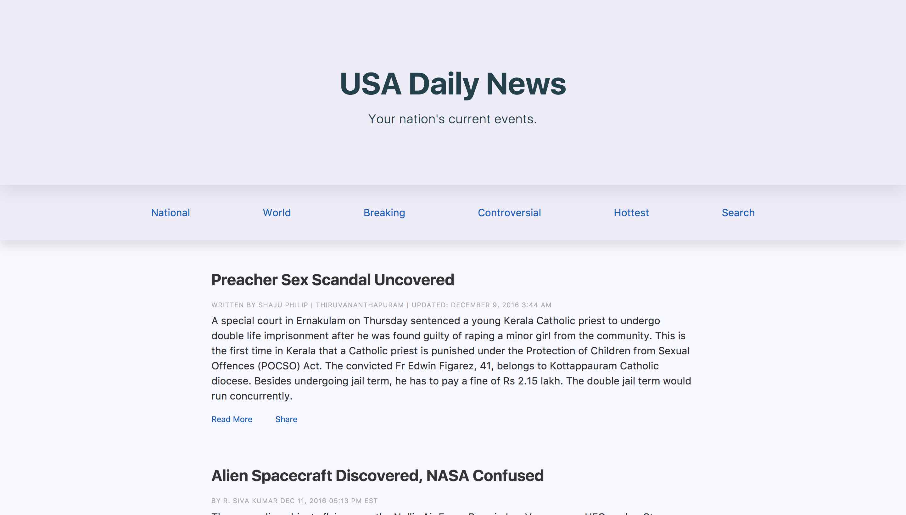
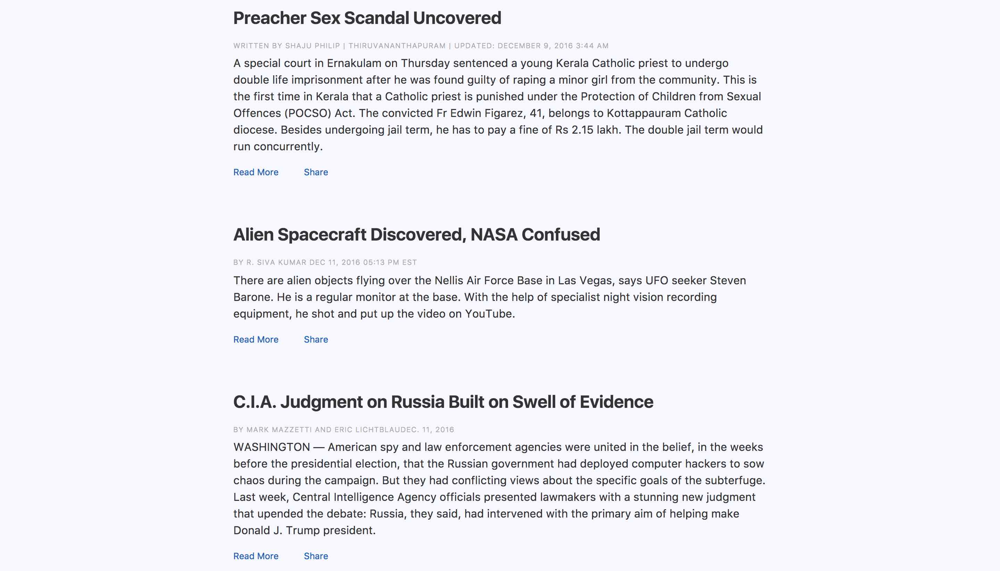

# gulping-neat-bitter-bourbon-panini
First attempt at using an HTML templating engine (Panini). Also uses Bourbon, Bitters, and Neat (from ThoughBot) and Gulp (but those aren't new to me)

## Overview
This project uses the Panini template engine for the HTML markup, the engine used by the Zurb Foundation 6 framework,
as well as SCSS for the CSS processor, which is augmented with ThoughtBot's SASS libraries/mixins/tools Bourbon mixins, Neat grid system, and Bitters scaffolding.

Gulp is used to automate the workflow and parsing/compiling/etc. of all these tools/files/etc.

Package dependency is managed by NPM.

## Thoughts
I'm pretty happy with the general outcome since writing my own Gulpfile's from scratch is still kind of new to me and, as I said,
I've never used Panini - or any HTML template engine - before.
  
  
That being said, the overall structure is messy, there is a lot of unused stuff, the gulpfile is a wreck, and the actual product doens't do anything at all.

  
But all in all, good learning experience. I made a repo just to have as future reference.

## Screenshots
Because, why not.

Screenshot 1

  

Screenshot 2
